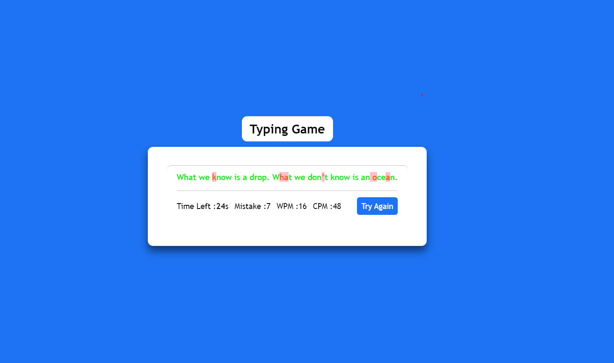

# Typing Game

This project is a **Typing Speed Test** application designed to help users measure their typing speed and accuracy by typing random quotes. Built using **HTML**, **CSS**, and **JavaScript**, it features a responsive UI, typing statistics like CPM (Characters Per Minute), WPM (Words Per Minute), mistake count, and a timer of 60 seconds to complete the challenge.

## 🌟 Features

- **Typing Speed Test:** Users can type random quotes to test their typing speed.
- **Statistics Display:** Shows real-time CPM (Characters Per Minute), WPM (Words Per Minute), and the number of mistakes.
- **Timer:** Users have 60 seconds to complete the typing task.
- **Mistake Highlighting:** Mistakes are shown directly on the UI while typing.
- **Responsive UI:** Clean and modern design with easy-to-read text and responsive layout.
- **Reset Functionality:** Users can reset the test and start over at any time.

## 📸 Screenshots

  
*Example 1*

  
*Example 2*

  
*Example 3*

## 🛠️ Technologies Used

- **HTML:** For structuring the webpage.
- **CSS:** For styling the game interface.
- **JavaScript:** For handling the game logic, calculations, and user interactions.
  
## 🚀 How to Use

1. Clone this repository to your local machine:

   ```bash
   git clone https://github.com/akashchaurasia3870/Typing-Game.git
   ```

2. Open the `index.html` file in your browser to start testing your typing speed.

---
